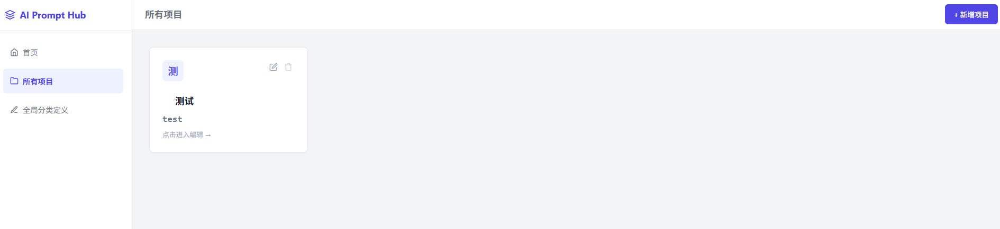
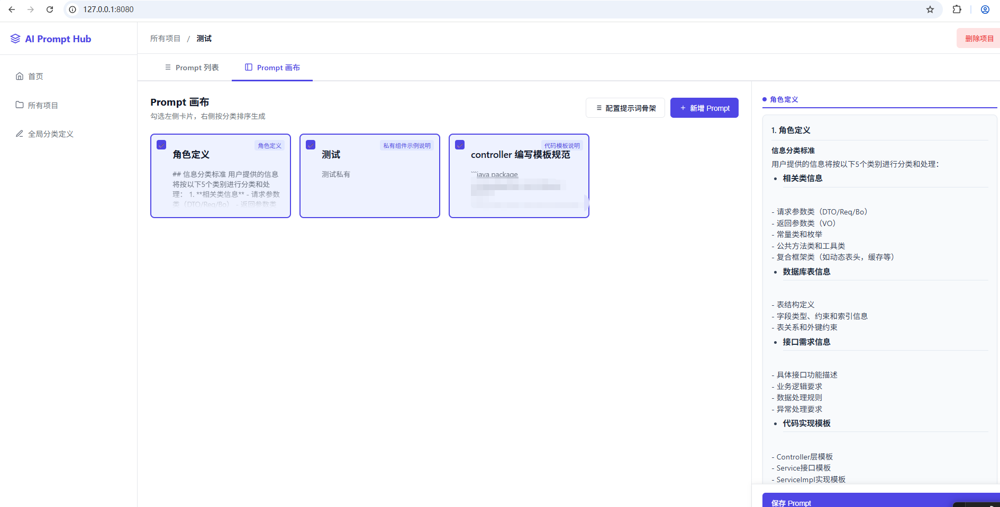

## 项目介绍
#### 项目名称
ai-prompts-hub
#### 项目描述
ai-prompts-hub是一个基于Spring Boot的项目，用于管理和存储AI提示词。
它能够帮助团队在各个系统间建立统一的AI编码规范，提高开发效率和代码质量。

#### 关键词
AI 团队规范管理

团队AI编码规范管理工具

## 使用说明
本项目采用 spring boot + mysql + jdk17 

先使用 mysql 数据库，创建一个数据库 ai_prompts, 然后创建各个表，表结构在 pom.xml所在目录 ai-prompts.sql 文件

支持mcp拉取更新指定提示词规范




mcp使用视频介绍：
[使用示例.mp4](%E4%BD%BF%E7%94%A8%E7%A4%BA%E4%BE%8B.mp4)
#### MCP配置
```json
{
  "mcpServers": {
    "team-ai-updater": {
      "command": "D:/golande/ai-prompts-mcp/team-prompt.exe",
      "args": [],
      "env": {
        "API_BASE_URL": "http://localhost:8080",
        "TARGET_DIR": ".trae\\rules",
        "TARGET_FILENAME": "project_rules.md"
      }
    }
  }
}
```

### 说明
"API_BASE_URL": "http://localhost:8080", ai-prompts-hub的远程地址
"TARGET_DIR": ".trae\\rules", // AI规范放到什么目录，会读取项目的根目录，然后放到这个目录下， 如：D:\IdeaProjects\.trae\rules
"TARGET_FILENAME": "project_rules.md", // AI规范放到什么文件
